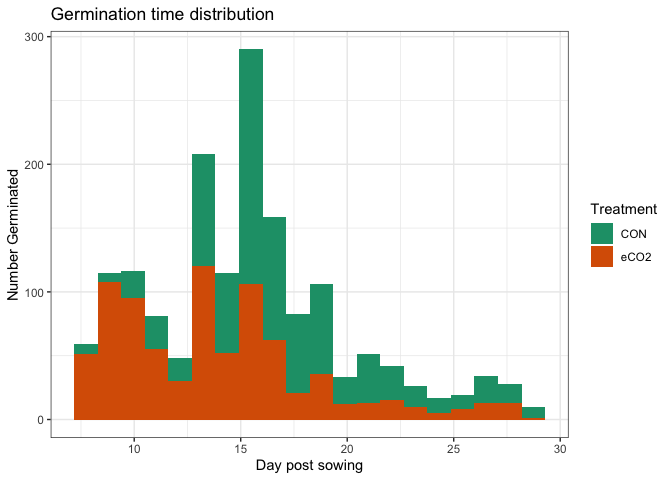
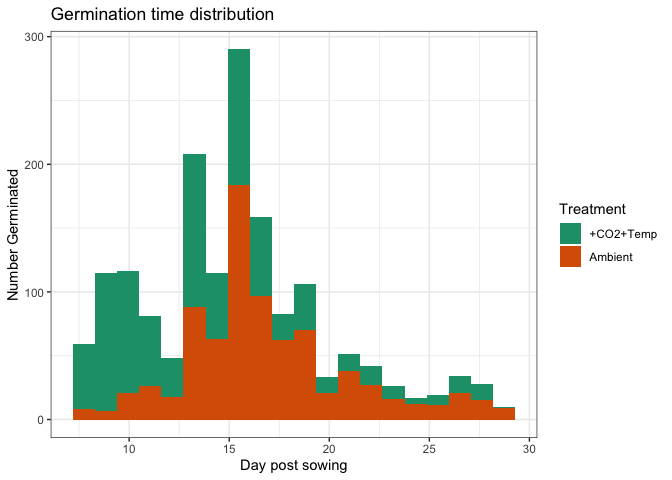
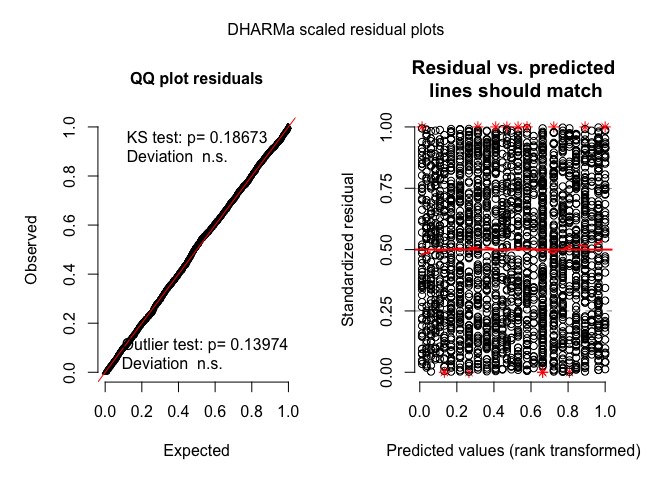
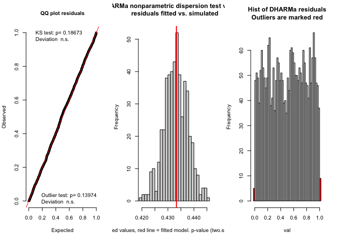
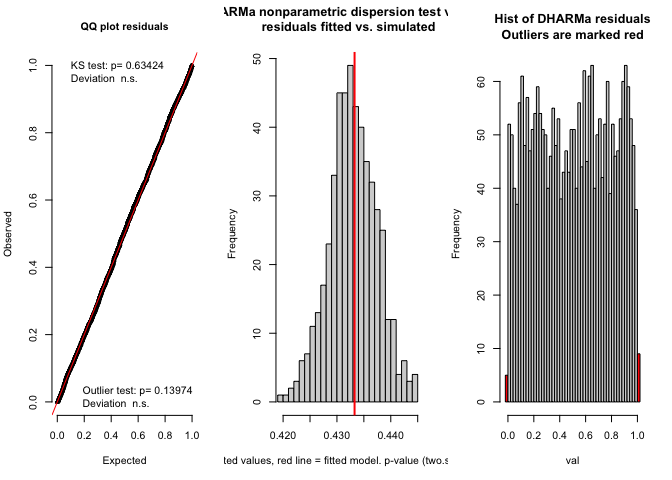
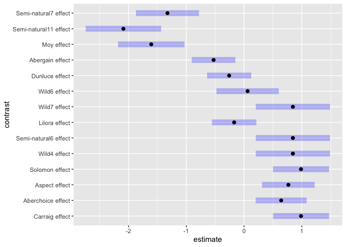
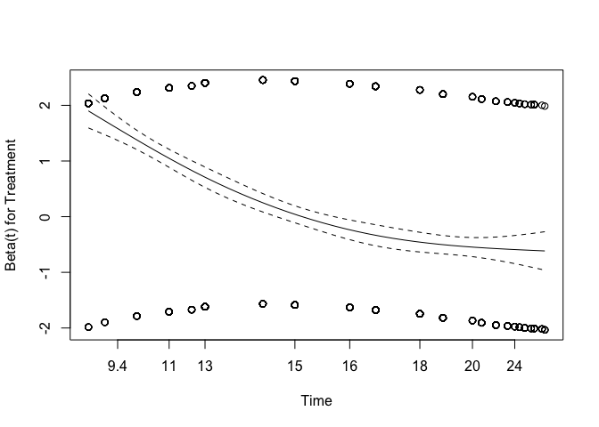
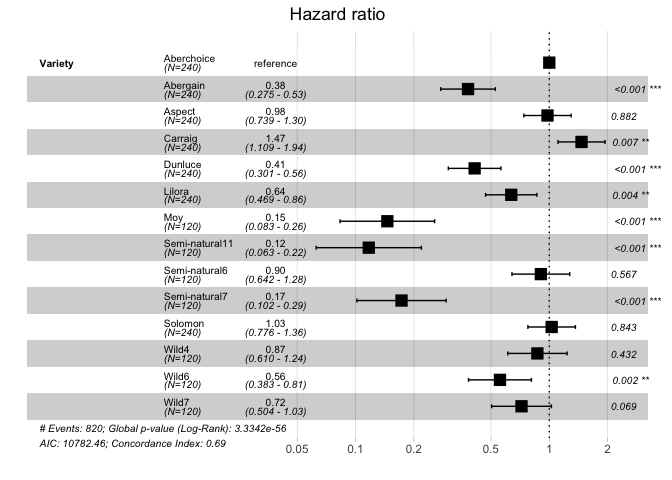

Phenograss: Survival analysis of germination data
================
Jon Yearsley
26th March 2020

## Setup and load data

``` r
rm(list=ls())

library(survival)
library(survminer)
library(timereg)
library(broom)
library(pander)
library(emmeans)
library(DHARMa)

# Load data
load('germination_data.RData')
```

## Overall visualisation

### Germination time distributions

<!-- -->

<!-- -->

<!-- -->

Look at overall numbers that germinated

``` r
germin_tab = table(germination$Treatment, 
                   germination$germinated)
pander(germin_tab, 
       caption = "Numbers germinating & not germinating within observation period")
```

|          | FALSE | TRUE |
| :------: | :---: | :--: |
| **CON**  |  440  | 820  |
| **eCO2** |  433  | 827  |

Numbers germinating & not germinating within observation period

Test to see if there’s an overall difference

``` r
pander(chisq.test(germin_tab), 
       caption = "Chi squared test of association on germin_tab")
```

| Test statistic | df | P value |
| :------------: | :-: | :-----: |
|     0.0631     | 1  | 0.8017  |

Chi squared test of association on germin\_tab

No difference in overall germination rate due to treatment

### Linear modelling of germination probability

Fit logistic model and test for difference between species and
treatments

``` r
m=glm(germinated~Treatment*Variety, data=germination, family='binomial')
```

Do some model validation

``` r
summary(m)
```

    ## 
    ## Call:
    ## glm(formula = germinated ~ Treatment * Variety, family = "binomial", 
    ##     data = germination)
    ## 
    ## Deviance Residuals: 
    ##     Min       1Q   Median       3Q      Max  
    ## -2.0074  -0.9833   0.6039   0.7585   1.8420  
    ## 
    ## Coefficients:
    ##                                     Estimate Std. Error z value Pr(>|z|)    
    ## (Intercept)                          1.28520    0.22159   5.800 6.63e-09 ***
    ## TreatmenteCO2                       -0.09561    0.30933  -0.309 0.757243    
    ## VarietyAbergain                     -1.28520    0.28711  -4.476 7.59e-06 ***
    ## VarietyAspect                        0.38548    0.33411   1.154 0.248604    
    ## VarietyCarraig                       0.51632    0.34297   1.505 0.132219    
    ## VarietyDunluce                      -1.01693    0.28816  -3.529 0.000417 ***
    ## VarietyLilora                       -0.80978    0.29043  -2.788 0.005301 ** 
    ## VarietyMoy                          -2.47478    0.37718  -6.561 5.34e-11 ***
    ## VarietySemi-natural11               -2.77912    0.40052  -6.939 3.96e-12 ***
    ## VarietySemi-natural6                 0.32424    0.41122   0.788 0.430412    
    ## VarietySemi-natural7                -2.29680    0.36651  -6.267 3.69e-10 ***
    ## VarietySolomon                       0.26540    0.32683   0.812 0.416773    
    ## VarietyWild4                        -0.09561    0.37718  -0.253 0.799886    
    ## VarietyWild6                        -0.66616    0.34980  -1.904 0.056858 .  
    ## VarietyWild7                        -0.18659    0.37147  -0.502 0.615461    
    ## TreatmenteCO2:VarietyAbergain        0.22915    0.40311   0.568 0.569735    
    ## TreatmenteCO2:VarietyAspect         -0.47646    0.45018  -1.058 0.289887    
    ## TreatmenteCO2:VarietyCarraig        -0.31961    0.46508  -0.687 0.491951    
    ## TreatmenteCO2:VarietyDunluce         0.23281    0.40539   0.574 0.565767    
    ## TreatmenteCO2:VarietyLilora         -0.00895    0.40673  -0.022 0.982444    
    ## TreatmenteCO2:VarietyMoy             0.43790    0.51790   0.846 0.397811    
    ## TreatmenteCO2:VarietySemi-natural11  0.09561    0.56420   0.169 0.865427    
    ## TreatmenteCO2:VarietySemi-natural6  -0.22862    0.56025  -0.408 0.683218    
    ## TreatmenteCO2:VarietySemi-natural7   0.63179    0.50141   1.260 0.207662    
    ## TreatmenteCO2:VarietySolomon         0.15446    0.46196   0.334 0.738116    
    ## TreatmenteCO2:VarietyWild4           0.64063    0.56530   1.133 0.257110    
    ## TreatmenteCO2:VarietyWild6           0.16972    0.49391   0.344 0.731123    
    ## TreatmenteCO2:VarietyWild7           0.86880    0.57341   1.515 0.129736    
    ## ---
    ## Signif. codes:  0 '***' 0.001 '**' 0.01 '*' 0.05 '.' 0.1 ' ' 1
    ## 
    ## (Dispersion parameter for binomial family taken to be 1)
    ## 
    ##     Null deviance: 3251.8  on 2519  degrees of freedom
    ## Residual deviance: 2816.7  on 2492  degrees of freedom
    ## AIC: 2872.7
    ## 
    ## Number of Fisher Scoring iterations: 4

The residual deviance divided by degrees of freedom is about 1, so an
indication that there’s no overdispersion.

``` r
# Simulate residuals from the model
val = simulateResiduals(m, n=500, refit=FALSE)
```

Create some validation plots

``` r
plot(val)
```

<!-- -->

``` r
testResiduals(val)
```

<!-- -->

    ## $uniformity
    ## 
    ##  One-sample Kolmogorov-Smirnov test
    ## 
    ## data:  simulationOutput$scaledResiduals
    ## D = 0.021687, p-value = 0.1867
    ## alternative hypothesis: two-sided
    ## 
    ## 
    ## $dispersion
    ## 
    ##  DHARMa nonparametric dispersion test via sd of residuals fitted vs.
    ##  simulated
    ## 
    ## data:  simulationOutput
    ## ratioObsSim = 1.0005, p-value = 0.968
    ## alternative hypothesis: two.sided
    ## 
    ## 
    ## $outliers
    ## 
    ##  DHARMa outlier test based on exact binomial test
    ## 
    ## data:  simulationOutput
    ## outLow = 5.000e+00, outHigh = 9.000e+00, nobs = 2.520e+03, freqH0 =
    ## 1.996e-03, p-value = 0.1397
    ## alternative hypothesis: two.sided

    ## $uniformity
    ## 
    ##  One-sample Kolmogorov-Smirnov test
    ## 
    ## data:  simulationOutput$scaledResiduals
    ## D = 0.021687, p-value = 0.1867
    ## alternative hypothesis: two-sided
    ## 
    ## 
    ## $dispersion
    ## 
    ##  DHARMa nonparametric dispersion test via sd of residuals fitted vs.
    ##  simulated
    ## 
    ## data:  simulationOutput
    ## ratioObsSim = 1.0005, p-value = 0.968
    ## alternative hypothesis: two.sided
    ## 
    ## 
    ## $outliers
    ## 
    ##  DHARMa outlier test based on exact binomial test
    ## 
    ## data:  simulationOutput
    ## outLow = 5.000e+00, outHigh = 9.000e+00, nobs = 2.520e+03, freqH0 =
    ## 1.996e-03, p-value = 0.1397
    ## alternative hypothesis: two.sided

Logistic model looks valid. Fit null models and do some hypothesis
testing.

``` r
m0 = update(m, .~.-Treatment:Variety)

pander(anova(m0,m, test='Chisq'))
```

| Resid. Df | Resid. Dev | Df | Deviance | Pr(\>Chi) |
| :-------: | :--------: | :-: | :------: | :-------: |
|   2505    |    2829    | NA |    NA    |    NA     |
|   2492    |    2817    | 13 |  12.39   |   0.496   |

Analysis of Deviance Table

No evidence of an interaction for total germination proportion

Test for effect of variety

``` r
m0b = update(m, .~.-Treatment:Variety - Variety)
pander(anova(m0b,m0, test='Chisq'))
```

| Resid. Df | Resid. Dev | Df | Deviance | Pr(\>Chi) |
| :-------: | :--------: | :-: | :------: | :-------: |
|   2518    |    3252    | NA |    NA    |    NA     |
|   2505    |    2829    | 13 |  422.6   | 3.683e-82 |

Analysis of Deviance Table

A strong effect of Variety

Test for effect of Treatement

``` r
m0c = update(m, .~.-Treatment:Variety - Treatment)
pander(anova(m0c,m0, test='Chisq'))
```

| Resid. Df | Resid. Dev | Df | Deviance | Pr(\>Chi) |
| :-------: | :--------: | :-: | :------: | :-------: |
|   2506    |    2829    | NA |    NA    |    NA     |
|   2505    |    2829    | 1  |  0.1032  |  0.7481   |

Analysis of Deviance Table

No effect of Treatment

Posthoc test for the effect of Variety and compare each

``` r
m_eff = emmeans(m0, specs = 'Variety')
m_posthoc = contrast(m_eff, method='eff')
m_posthoc
```

    ##  contrast              estimate    SE  df z.ratio p.value
    ##  Aberchoice effect       0.6425 0.152 Inf  4.236  <.0001 
    ##  Abergain effect        -0.5276 0.130 Inf -4.068  0.0001 
    ##  Aspect effect           0.7662 0.157 Inf  4.895  <.0001 
    ##  Carraig effect          0.9855 0.167 Inf  5.917  <.0001 
    ##  Dunluce effect         -0.2578 0.131 Inf -1.965  0.0577 
    ##  Lilora effect          -0.1714 0.132 Inf -1.297  0.2094 
    ##  Moy effect             -1.6060 0.198 Inf -8.127  <.0001 
    ##  Semi-natural11 effect  -2.0883 0.224 Inf -9.318  <.0001 
    ##  Semi-natural6 effect    0.8450 0.221 Inf  3.832  0.0002 
    ##  Semi-natural7 effect   -1.3252 0.187 Inf -7.075  <.0001 
    ##  Solomon effect          0.9855 0.167 Inf  5.917  <.0001 
    ##  Wild4 effect            0.8450 0.221 Inf  3.832  0.0002 
    ##  Wild6 effect            0.0616 0.185 Inf  0.333  0.7393 
    ##  Wild7 effect            0.8450 0.221 Inf  3.832  0.0002 
    ## 
    ## Results are averaged over the levels of: Treatment 
    ## Results are given on the log odds ratio (not the response) scale. 
    ## P value adjustment: fdr method for 14 tests

Plot the posthoc analysis

<!-- -->

## Calculate Kaplan-Meier survival curve

This is a non-parametric approach, and doesn’t have the same assumptions
as Cox PH model. We use the approach to estimate the survival curve for
germination, and to test if Treatment has an effect (averaged across
varieties)

The survival curve normally corresponds to the probability of dying. In
our case it is the probability of germinating. The hazard rate has a
similar interpretation.

### Survival curve for each Variety and Treatment

``` r
# Effect of Treatment for each Variety
germ_fit = survfit(Surv(Day, germinated) ~ Variety + Treatment, 
                             data=germination)
```

Display median survival times (i.e. germination times) and confidence
intervals

``` r
# Print estimates of time to germination
pander(germ_fit)
```

|                                            | records | n.max | n.start | events | median |
| :----------------------------------------: | :-----: | :---: | :-----: | :----: | :----: |
|   **Variety=Aberchoice, Treatment=CON**    |   120   |  120  |   120   |   94   |   16   |
|   **Variety=Aberchoice, Treatment=eCO2**   |   120   |  120  |   120   |   92   |   13   |
|    **Variety=Abergain, Treatment=CON**     |   120   |  120  |   120   |   60   |   30   |
|    **Variety=Abergain, Treatment=eCO2**    |   120   |  120  |   120   |   64   |  22.5  |
|     **Variety=Aspect, Treatment=CON**      |   120   |  120  |   120   |  101   |   17   |
|     **Variety=Aspect, Treatment=eCO2**     |   120   |  120  |   120   |   90   |  14.5  |
|     **Variety=Carraig, Treatment=CON**     |   120   |  120  |   120   |  103   |   15   |
|    **Variety=Carraig, Treatment=eCO2**     |   120   |  120  |   120   |   96   |   10   |
|     **Variety=Dunluce, Treatment=CON**     |   120   |  120  |   120   |   68   |   27   |
|    **Variety=Dunluce, Treatment=eCO2**     |   120   |  120  |   120   |   72   |   22   |
|     **Variety=Lilora, Treatment=CON**      |   120   |  120  |   120   |   74   |   19   |
|     **Variety=Lilora, Treatment=eCO2**     |   120   |  120  |   120   |   71   |  18.5  |
|       **Variety=Moy, Treatment=CON**       |   60    |  60   |   60    |   14   |   NA   |
|      **Variety=Moy, Treatment=eCO2**       |   60    |  60   |   60    |   18   |   NA   |
| **Variety=Semi-natural11, Treatment=CON**  |   60    |  60   |   60    |   11   |   NA   |
| **Variety=Semi-natural11, Treatment=eCO2** |   60    |  60   |   60    |   11   |   NA   |
|  **Variety=Semi-natural6, Treatment=CON**  |   60    |  60   |   60    |   50   |   18   |
| **Variety=Semi-natural6, Treatment=eCO2**  |   60    |  60   |   60    |   47   |   14   |
|  **Variety=Semi-natural7, Treatment=CON**  |   60    |  60   |   60    |   16   |   NA   |
| **Variety=Semi-natural7, Treatment=eCO2**  |   60    |  60   |   60    |   23   |   NA   |
|     **Variety=Solomon, Treatment=CON**     |   120   |  120  |   120   |   99   |   17   |
|    **Variety=Solomon, Treatment=eCO2**     |   120   |  120  |   120   |  100   |   12   |
|      **Variety=Wild4, Treatment=CON**      |   60    |  60   |   60    |   46   |   17   |
|     **Variety=Wild4, Treatment=eCO2**      |   60    |  60   |   60    |   51   |   14   |
|      **Variety=Wild6, Treatment=CON**      |   60    |  60   |   60    |   39   |   22   |
|     **Variety=Wild6, Treatment=eCO2**      |   60    |  60   |   60    |   40   |   18   |
|      **Variety=Wild7, Treatment=CON**      |   60    |  60   |   60    |   45   |   19   |
|     **Variety=Wild7, Treatment=eCO2**      |   60    |  60   |   60    |   52   |   13   |

Table continues below

|                                            | 0.95LCL | 0.95UCL |
| :----------------------------------------: | :-----: | :-----: |
|   **Variety=Aberchoice, Treatment=CON**    |   15    |   17    |
|   **Variety=Aberchoice, Treatment=eCO2**   |   12    |   15    |
|    **Variety=Abergain, Treatment=CON**     |   25    |   NA    |
|    **Variety=Abergain, Treatment=eCO2**    |   18    |   NA    |
|     **Variety=Aspect, Treatment=CON**      |   17    |   18    |
|     **Variety=Aspect, Treatment=eCO2**     |   13    |   17    |
|     **Variety=Carraig, Treatment=CON**     |   14    |   15    |
|    **Variety=Carraig, Treatment=eCO2**     |   10    |   13    |
|     **Variety=Dunluce, Treatment=CON**     |   24    |   NA    |
|    **Variety=Dunluce, Treatment=eCO2**     |   19    |   29    |
|     **Variety=Lilora, Treatment=CON**      |   16    |   26    |
|     **Variety=Lilora, Treatment=eCO2**     |   15    |   NA    |
|       **Variety=Moy, Treatment=CON**       |   NA    |   NA    |
|      **Variety=Moy, Treatment=eCO2**       |   NA    |   NA    |
| **Variety=Semi-natural11, Treatment=CON**  |   NA    |   NA    |
| **Variety=Semi-natural11, Treatment=eCO2** |   NA    |   NA    |
|  **Variety=Semi-natural6, Treatment=CON**  |   17    |   19    |
| **Variety=Semi-natural6, Treatment=eCO2**  |   13    |   17    |
|  **Variety=Semi-natural7, Treatment=CON**  |   NA    |   NA    |
| **Variety=Semi-natural7, Treatment=eCO2**  |   NA    |   NA    |
|     **Variety=Solomon, Treatment=CON**     |   16    |   18    |
|    **Variety=Solomon, Treatment=eCO2**     |   11    |   13    |
|      **Variety=Wild4, Treatment=CON**      |   16    |   19    |
|     **Variety=Wild4, Treatment=eCO2**      |   13    |   15    |
|      **Variety=Wild6, Treatment=CON**      |   19    |   30    |
|     **Variety=Wild6, Treatment=eCO2**      |   17    |   26    |
|      **Variety=Wild7, Treatment=CON**      |   18    |   21    |
|     **Variety=Wild7, Treatment=eCO2**      |   13    |   16    |

### Look at survival curves, averaging over varieties

``` r
# Effect of treatment averaging over variety
germ_fit_treatment = survfit(Surv(Day, germinated) ~ Treatment, 
                             data=germination)
```

Display

``` r
# Display results of average time to germination across varieties
pander(germ_fit_treatment)
```

|                    | records | n.max | n.start | events | median | 0.95LCL | 0.95UCL |
| :----------------: | :-----: | :---: | :-----: | :----: | :----: | :-----: | :-----: |
| **Treatment=CON**  |  1260   | 1260  |  1260   |  820   |   19   |   19    |   21    |
| **Treatment=eCO2** |  1260   | 1260  |  1260   |  827   |   17   |   16    |   17    |

Plot survival curves for Treatments (averaging across varieties)
<!-- -->

#### Hypothesis test

Perform a log-ratio test of difference between survival curves for
control - treatment

``` r
pander(survdiff(Surv(Day, germinated) ~ Treatment, 
         data=germination))
```

|                    |  N   | Observed | Expected | (O-E)^2/E | (O-E)^2/V |
| :----------------: | :--: | :------: | :------: | :-------: | :-------: |
| **Treatment=CON**  | 1260 |   820    |  906.8   |   8.315   |   19.86   |
| **Treatment=eCO2** | 1260 |   827    |  740.2   |   10.19   |   19.86   |

Call: Surv(Day, germinated) \~ Treatment Chisq = 19.864297 on 1 degrees
of freedom, p = 0.000008

## Parametric models of germination

Try to fit a Cox proportional hazards model. This is a parametric model
that assumes a constant proportional hazard rate. This assumption must
be validated

Fit model with Treatment and Variety. There’s no evidence of an
interaction between Treatment and Variety

``` r
# Fit the full model with main effects and interaction
coxph.fit <- coxph(Surv(Day, germinated) ~ Treatment+Variety, 
                   data=germination, 
                   method="breslow")  # Could use efron
```

Same model but treat Variety as a random effect

``` r
# Fit the full model with main effects and random term for Variety
coxph.rand <- coxph(Surv(Day, germinated) ~ Treatment + frailty(Variety),
                    data=germination)
```

Validate the proportional hazard assumption

``` r
# Validate hazard function assumption
test.ph <- cox.zph(coxph.fit)
pander(test.ph$table)
```

|               | chisq | df |     p     |
| :-----------: | :---: | :-: | :-------: |
| **Treatment** |  222  | 1  | 3.368e-50 |
|  **Variety**  | 173.6 | 13 | 3.369e-30 |
|  **GLOBAL**   | 393.7 | 14 | 2.677e-75 |

Looks like the assumption is violated. Meaning that the effect of
Treatment and Variety on germination rate varies with time.

Look at some visuals

``` r
plot(test.ph)
```

<!-- --><!-- -->

Looks like proportional hazard decreases over time for the treatment
effect. The effect of Variety seems to be less of an issue.

Look at model with Variety as a random effect

``` r
test2.ph <- cox.zph(coxph.rand)
pander(test2.ph$table)
```

|               | chisq |   df   |     p     |
| :-----------: | :---: | :----: | :-------: |
| **Treatment** | 236.9 | 0.9999 | 1.848e-53 |
|  **GLOBAL**   | 236.9 | 14.85  | 4.946e-42 |

``` r
plot(test2.ph)
```

<!-- -->

Same message. Looks like proportional hazard decreases over time for the
treatment effect

Need to find time varying version of Cox model.

### Effect of variety

Use Cox PH model on data from the control

``` r
# Fit the full model
coxph.fit_full <- coxph(Surv(Day, germinated) ~ Variety, 
                        data=subset(germination, Treatment=='CON'), 
                        method="breslow")  # Could use efron

# Fit null model testing for Variety on control data
coxph.fit_null <- coxph(Surv(Day, germinated) ~ 1, 
                         data=subset(germination, Treatment=='CON'), 
                         method="breslow")  # Could use efron

# Perform hypothesis test
anova(coxph.fit_full, coxph.fit_null, test='ChiSq')
```

    ## Analysis of Deviance Table
    ##  Cox model: response is  Surv(Day, germinated)
    ##  Model 1: ~ Variety
    ##  Model 2: ~ 1
    ##    loglik  Chisq Df P(>|Chi|)    
    ## 1 -5378.2                        
    ## 2 -5527.9 299.32 13 < 2.2e-16 ***
    ## ---
    ## Signif. codes:  0 '***' 0.001 '**' 0.01 '*' 0.05 '.' 0.1 ' ' 1

Strong effect of Variety on germination. Plot the hazard ratio for the
model with main effect variety

    ## Warning: Removed 1 rows containing missing values (geom_errorbar).

<!-- -->

``` r
survfit(coxph.fit_full)
```

    ## Call: survfit(formula = coxph.fit_full)
    ## 
    ##       n  events  median 0.95LCL 0.95UCL 
    ##    1260     820      21      19      22
