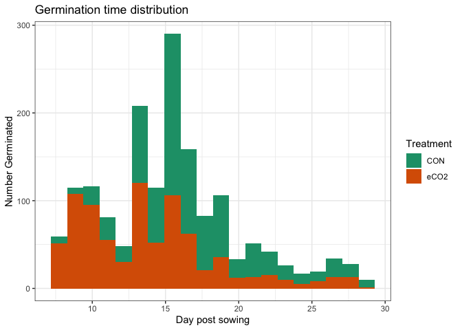
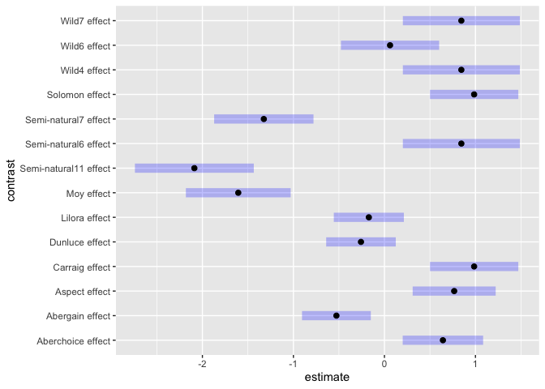
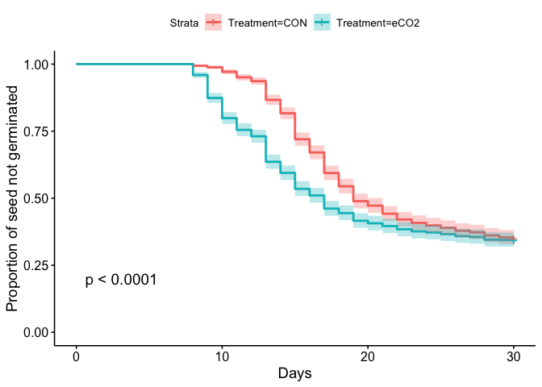
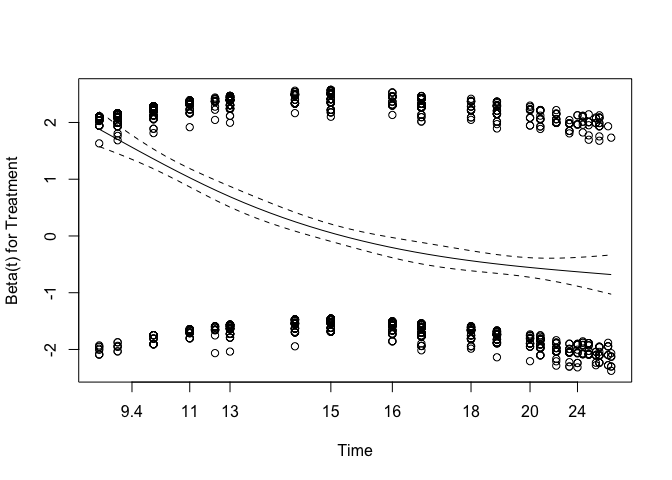
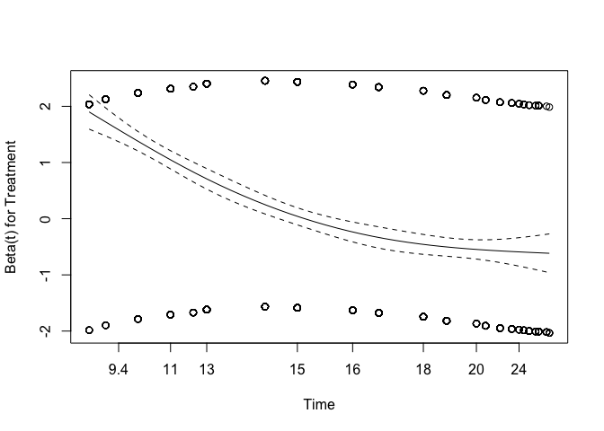
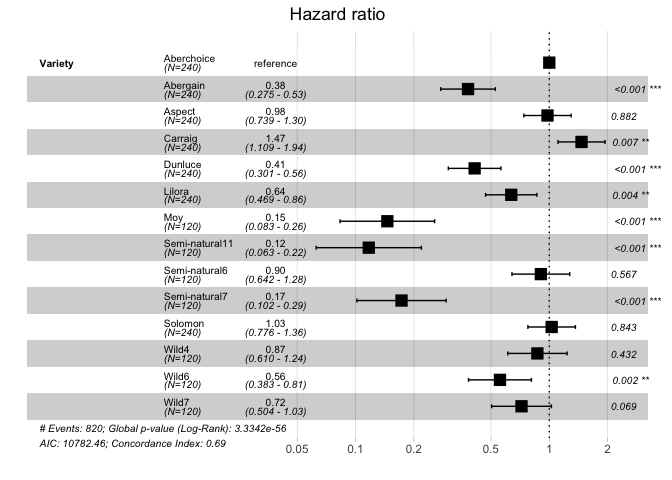
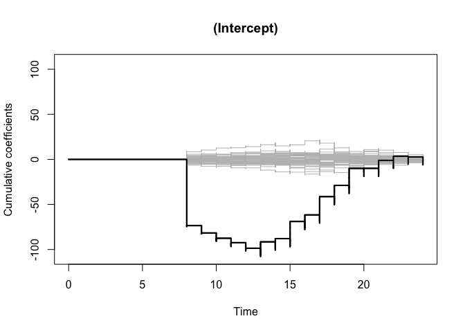
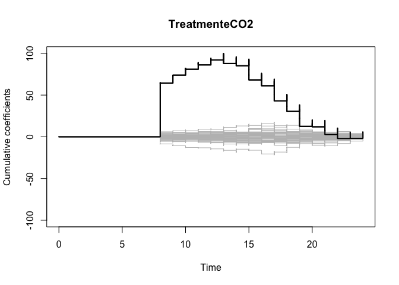

Setup and load data
-------------------

    rm(list=ls())

    library(survival)
    library(survminer)
    library(timereg)
    library(broom)
    library(pander)
    library(emmeans)

    # Load data
    load('germination_data.RData')

Overall visualisation
---------------------

Look at overall numbers that germinated

    germin_tab = table(germination$Treatment, 
                       germination$germinated)
    pander(germin_tab, 
           caption = "Numbers germinating & not germinating within observation period")

<table style="width:38%;">
<caption>Numbers germinating &amp; not germinating within observation period</caption>
<colgroup>
<col style="width: 15%" />
<col style="width: 11%" />
<col style="width: 11%" />
</colgroup>
<thead>
<tr class="header">
<th style="text-align: center;"> </th>
<th style="text-align: center;">FALSE</th>
<th style="text-align: center;">TRUE</th>
</tr>
</thead>
<tbody>
<tr class="odd">
<td style="text-align: center;"><strong>CON</strong></td>
<td style="text-align: center;">440</td>
<td style="text-align: center;">820</td>
</tr>
<tr class="even">
<td style="text-align: center;"><strong>eCO2</strong></td>
<td style="text-align: center;">433</td>
<td style="text-align: center;">827</td>
</tr>
</tbody>
</table>

Test to see if there’s an overall difference

    pander(chisq.test(germin_tab), 
           caption = "Chi squared test of association on germin_tab")

<table style="width:44%;">
<caption>Chi squared test of association on germin_tab</caption>
<colgroup>
<col style="width: 23%" />
<col style="width: 6%" />
<col style="width: 13%" />
</colgroup>
<thead>
<tr class="header">
<th style="text-align: center;">Test statistic</th>
<th style="text-align: center;">df</th>
<th style="text-align: center;">P value</th>
</tr>
</thead>
<tbody>
<tr class="odd">
<td style="text-align: center;">0.0631</td>
<td style="text-align: center;">1</td>
<td style="text-align: center;">0.8017</td>
</tr>
</tbody>
</table>

No difference in overall germination rate due to treatment

### Linear modelling of germination probability

Fit logistic model and test for difference between species and
treatments

    m=glm(germinated~Treatment*Variety, data=germination, family='binomial')
    m0 = update(m, .~.-Treatment:Variety)

    pander(anova(m0,m, test='Chisq'))

<table style="width:72%;">
<caption>Analysis of Deviance Table</caption>
<colgroup>
<col style="width: 16%" />
<col style="width: 18%" />
<col style="width: 6%" />
<col style="width: 15%" />
<col style="width: 15%" />
</colgroup>
<thead>
<tr class="header">
<th style="text-align: center;">Resid. Df</th>
<th style="text-align: center;">Resid. Dev</th>
<th style="text-align: center;">Df</th>
<th style="text-align: center;">Deviance</th>
<th style="text-align: center;">Pr(&gt;Chi)</th>
</tr>
</thead>
<tbody>
<tr class="odd">
<td style="text-align: center;">2505</td>
<td style="text-align: center;">2829</td>
<td style="text-align: center;">NA</td>
<td style="text-align: center;">NA</td>
<td style="text-align: center;">NA</td>
</tr>
<tr class="even">
<td style="text-align: center;">2492</td>
<td style="text-align: center;">2817</td>
<td style="text-align: center;">13</td>
<td style="text-align: center;">12.39</td>
<td style="text-align: center;">0.496</td>
</tr>
</tbody>
</table>

No evidence of an interaction for total germination proportion

Test for effect of variety

    m0b = update(m, .~.-Treatment:Variety - Variety)
    pander(anova(m0b,m0, test='Chisq'))

<table style="width:74%;">
<caption>Analysis of Deviance Table</caption>
<colgroup>
<col style="width: 16%" />
<col style="width: 18%" />
<col style="width: 6%" />
<col style="width: 15%" />
<col style="width: 16%" />
</colgroup>
<thead>
<tr class="header">
<th style="text-align: center;">Resid. Df</th>
<th style="text-align: center;">Resid. Dev</th>
<th style="text-align: center;">Df</th>
<th style="text-align: center;">Deviance</th>
<th style="text-align: center;">Pr(&gt;Chi)</th>
</tr>
</thead>
<tbody>
<tr class="odd">
<td style="text-align: center;">2518</td>
<td style="text-align: center;">3252</td>
<td style="text-align: center;">NA</td>
<td style="text-align: center;">NA</td>
<td style="text-align: center;">NA</td>
</tr>
<tr class="even">
<td style="text-align: center;">2505</td>
<td style="text-align: center;">2829</td>
<td style="text-align: center;">13</td>
<td style="text-align: center;">422.6</td>
<td style="text-align: center;">3.683e-82</td>
</tr>
</tbody>
</table>

A strong effect of Variety

Test for effect of Treatement

    m0c = update(m, .~.-Treatment:Variety - Treatment)
    pander(anova(m0c,m0, test='Chisq'))

<table style="width:72%;">
<caption>Analysis of Deviance Table</caption>
<colgroup>
<col style="width: 16%" />
<col style="width: 18%" />
<col style="width: 6%" />
<col style="width: 15%" />
<col style="width: 15%" />
</colgroup>
<thead>
<tr class="header">
<th style="text-align: center;">Resid. Df</th>
<th style="text-align: center;">Resid. Dev</th>
<th style="text-align: center;">Df</th>
<th style="text-align: center;">Deviance</th>
<th style="text-align: center;">Pr(&gt;Chi)</th>
</tr>
</thead>
<tbody>
<tr class="odd">
<td style="text-align: center;">2506</td>
<td style="text-align: center;">2829</td>
<td style="text-align: center;">NA</td>
<td style="text-align: center;">NA</td>
<td style="text-align: center;">NA</td>
</tr>
<tr class="even">
<td style="text-align: center;">2505</td>
<td style="text-align: center;">2829</td>
<td style="text-align: center;">1</td>
<td style="text-align: center;">0.1032</td>
<td style="text-align: center;">0.7481</td>
</tr>
</tbody>
</table>

No effect of Treatment

Posthoc test for the effect of Variety and compare each

    m_eff = emmeans(m0, specs = 'Variety')
    m_posthoc = contrast(m_eff, method='eff')
    m_posthoc

    ##  contrast              estimate    SE  df z.ratio p.value
    ##  Aberchoice effect       0.6425 0.152 Inf  4.236  <.0001 
    ##  Abergain effect        -0.5276 0.130 Inf -4.068  0.0001 
    ##  Aspect effect           0.7662 0.157 Inf  4.895  <.0001 
    ##  Carraig effect          0.9855 0.167 Inf  5.917  <.0001 
    ##  Dunluce effect         -0.2578 0.131 Inf -1.965  0.0577 
    ##  Lilora effect          -0.1714 0.132 Inf -1.297  0.2094 
    ##  Moy effect             -1.6060 0.198 Inf -8.127  <.0001 
    ##  Semi-natural11 effect  -2.0883 0.224 Inf -9.318  <.0001 
    ##  Semi-natural6 effect    0.8450 0.221 Inf  3.832  0.0002 
    ##  Semi-natural7 effect   -1.3252 0.187 Inf -7.075  <.0001 
    ##  Solomon effect          0.9855 0.167 Inf  5.917  <.0001 
    ##  Wild4 effect            0.8450 0.221 Inf  3.832  0.0002 
    ##  Wild6 effect            0.0616 0.185 Inf  0.333  0.7393 
    ##  Wild7 effect            0.8450 0.221 Inf  3.832  0.0002 
    ## 
    ## Results are averaged over the levels of: Treatment 
    ## Results are given on the log odds ratio (not the response) scale. 
    ## P value adjustment: fdr method for 14 tests

Plot the posthoc analysis

Calculate Kaplan-Meier survival curve
-------------------------------------

This is a non-parametric approach, and doesn’t have the same assumptions
as Cox PH model. We use the approach to estimate the survival curve for
germination, and to test if Treatment has an effect (averaged across
varieties)

The survival curve normally corresponds to the probability of dying. In
our case it is the probability of germinating. The hazard rate has a
similar interpretation.

### Survival curve for each Variety and Treatment

    # Effect of Treatment for each Variety
    germ_fit = survfit(Surv(Day, germinated) ~ Variety + Treatment, 
                                 data=germination)

Display median survival times (i.e. germination times) and confidence
intervals

    # Print estimates of time to germination
    pander(germ_fit)

<table>
<caption>Table continues below</caption>
<colgroup>
<col style="width: 41%" />
<col style="width: 12%" />
<col style="width: 10%" />
<col style="width: 12%" />
<col style="width: 11%" />
<col style="width: 11%" />
</colgroup>
<thead>
<tr class="header">
<th style="text-align: center;"> </th>
<th style="text-align: center;">records</th>
<th style="text-align: center;">n.max</th>
<th style="text-align: center;">n.start</th>
<th style="text-align: center;">events</th>
<th style="text-align: center;">median</th>
</tr>
</thead>
<tbody>
<tr class="odd">
<td style="text-align: center;"><strong>Variety=Aberchoice, Treatment=CON</strong></td>
<td style="text-align: center;">120</td>
<td style="text-align: center;">120</td>
<td style="text-align: center;">120</td>
<td style="text-align: center;">94</td>
<td style="text-align: center;">16</td>
</tr>
<tr class="even">
<td style="text-align: center;"><strong>Variety=Aberchoice, Treatment=eCO2</strong></td>
<td style="text-align: center;">120</td>
<td style="text-align: center;">120</td>
<td style="text-align: center;">120</td>
<td style="text-align: center;">92</td>
<td style="text-align: center;">13</td>
</tr>
<tr class="odd">
<td style="text-align: center;"><strong>Variety=Abergain, Treatment=CON</strong></td>
<td style="text-align: center;">120</td>
<td style="text-align: center;">120</td>
<td style="text-align: center;">120</td>
<td style="text-align: center;">60</td>
<td style="text-align: center;">30</td>
</tr>
<tr class="even">
<td style="text-align: center;"><strong>Variety=Abergain, Treatment=eCO2</strong></td>
<td style="text-align: center;">120</td>
<td style="text-align: center;">120</td>
<td style="text-align: center;">120</td>
<td style="text-align: center;">64</td>
<td style="text-align: center;">22.5</td>
</tr>
<tr class="odd">
<td style="text-align: center;"><strong>Variety=Aspect, Treatment=CON</strong></td>
<td style="text-align: center;">120</td>
<td style="text-align: center;">120</td>
<td style="text-align: center;">120</td>
<td style="text-align: center;">101</td>
<td style="text-align: center;">17</td>
</tr>
<tr class="even">
<td style="text-align: center;"><strong>Variety=Aspect, Treatment=eCO2</strong></td>
<td style="text-align: center;">120</td>
<td style="text-align: center;">120</td>
<td style="text-align: center;">120</td>
<td style="text-align: center;">90</td>
<td style="text-align: center;">14.5</td>
</tr>
<tr class="odd">
<td style="text-align: center;"><strong>Variety=Carraig, Treatment=CON</strong></td>
<td style="text-align: center;">120</td>
<td style="text-align: center;">120</td>
<td style="text-align: center;">120</td>
<td style="text-align: center;">103</td>
<td style="text-align: center;">15</td>
</tr>
<tr class="even">
<td style="text-align: center;"><strong>Variety=Carraig, Treatment=eCO2</strong></td>
<td style="text-align: center;">120</td>
<td style="text-align: center;">120</td>
<td style="text-align: center;">120</td>
<td style="text-align: center;">96</td>
<td style="text-align: center;">10</td>
</tr>
<tr class="odd">
<td style="text-align: center;"><strong>Variety=Dunluce, Treatment=CON</strong></td>
<td style="text-align: center;">120</td>
<td style="text-align: center;">120</td>
<td style="text-align: center;">120</td>
<td style="text-align: center;">68</td>
<td style="text-align: center;">27</td>
</tr>
<tr class="even">
<td style="text-align: center;"><strong>Variety=Dunluce, Treatment=eCO2</strong></td>
<td style="text-align: center;">120</td>
<td style="text-align: center;">120</td>
<td style="text-align: center;">120</td>
<td style="text-align: center;">72</td>
<td style="text-align: center;">22</td>
</tr>
<tr class="odd">
<td style="text-align: center;"><strong>Variety=Lilora, Treatment=CON</strong></td>
<td style="text-align: center;">120</td>
<td style="text-align: center;">120</td>
<td style="text-align: center;">120</td>
<td style="text-align: center;">74</td>
<td style="text-align: center;">19</td>
</tr>
<tr class="even">
<td style="text-align: center;"><strong>Variety=Lilora, Treatment=eCO2</strong></td>
<td style="text-align: center;">120</td>
<td style="text-align: center;">120</td>
<td style="text-align: center;">120</td>
<td style="text-align: center;">71</td>
<td style="text-align: center;">18.5</td>
</tr>
<tr class="odd">
<td style="text-align: center;"><strong>Variety=Moy, Treatment=CON</strong></td>
<td style="text-align: center;">60</td>
<td style="text-align: center;">60</td>
<td style="text-align: center;">60</td>
<td style="text-align: center;">14</td>
<td style="text-align: center;">NA</td>
</tr>
<tr class="even">
<td style="text-align: center;"><strong>Variety=Moy, Treatment=eCO2</strong></td>
<td style="text-align: center;">60</td>
<td style="text-align: center;">60</td>
<td style="text-align: center;">60</td>
<td style="text-align: center;">18</td>
<td style="text-align: center;">NA</td>
</tr>
<tr class="odd">
<td style="text-align: center;"><strong>Variety=Semi-natural11, Treatment=CON</strong></td>
<td style="text-align: center;">60</td>
<td style="text-align: center;">60</td>
<td style="text-align: center;">60</td>
<td style="text-align: center;">11</td>
<td style="text-align: center;">NA</td>
</tr>
<tr class="even">
<td style="text-align: center;"><strong>Variety=Semi-natural11, Treatment=eCO2</strong></td>
<td style="text-align: center;">60</td>
<td style="text-align: center;">60</td>
<td style="text-align: center;">60</td>
<td style="text-align: center;">11</td>
<td style="text-align: center;">NA</td>
</tr>
<tr class="odd">
<td style="text-align: center;"><strong>Variety=Semi-natural6, Treatment=CON</strong></td>
<td style="text-align: center;">60</td>
<td style="text-align: center;">60</td>
<td style="text-align: center;">60</td>
<td style="text-align: center;">50</td>
<td style="text-align: center;">18</td>
</tr>
<tr class="even">
<td style="text-align: center;"><strong>Variety=Semi-natural6, Treatment=eCO2</strong></td>
<td style="text-align: center;">60</td>
<td style="text-align: center;">60</td>
<td style="text-align: center;">60</td>
<td style="text-align: center;">47</td>
<td style="text-align: center;">14</td>
</tr>
<tr class="odd">
<td style="text-align: center;"><strong>Variety=Semi-natural7, Treatment=CON</strong></td>
<td style="text-align: center;">60</td>
<td style="text-align: center;">60</td>
<td style="text-align: center;">60</td>
<td style="text-align: center;">16</td>
<td style="text-align: center;">NA</td>
</tr>
<tr class="even">
<td style="text-align: center;"><strong>Variety=Semi-natural7, Treatment=eCO2</strong></td>
<td style="text-align: center;">60</td>
<td style="text-align: center;">60</td>
<td style="text-align: center;">60</td>
<td style="text-align: center;">23</td>
<td style="text-align: center;">NA</td>
</tr>
<tr class="odd">
<td style="text-align: center;"><strong>Variety=Solomon, Treatment=CON</strong></td>
<td style="text-align: center;">120</td>
<td style="text-align: center;">120</td>
<td style="text-align: center;">120</td>
<td style="text-align: center;">99</td>
<td style="text-align: center;">17</td>
</tr>
<tr class="even">
<td style="text-align: center;"><strong>Variety=Solomon, Treatment=eCO2</strong></td>
<td style="text-align: center;">120</td>
<td style="text-align: center;">120</td>
<td style="text-align: center;">120</td>
<td style="text-align: center;">100</td>
<td style="text-align: center;">12</td>
</tr>
<tr class="odd">
<td style="text-align: center;"><strong>Variety=Wild4, Treatment=CON</strong></td>
<td style="text-align: center;">60</td>
<td style="text-align: center;">60</td>
<td style="text-align: center;">60</td>
<td style="text-align: center;">46</td>
<td style="text-align: center;">17</td>
</tr>
<tr class="even">
<td style="text-align: center;"><strong>Variety=Wild4, Treatment=eCO2</strong></td>
<td style="text-align: center;">60</td>
<td style="text-align: center;">60</td>
<td style="text-align: center;">60</td>
<td style="text-align: center;">51</td>
<td style="text-align: center;">14</td>
</tr>
<tr class="odd">
<td style="text-align: center;"><strong>Variety=Wild6, Treatment=CON</strong></td>
<td style="text-align: center;">60</td>
<td style="text-align: center;">60</td>
<td style="text-align: center;">60</td>
<td style="text-align: center;">39</td>
<td style="text-align: center;">22</td>
</tr>
<tr class="even">
<td style="text-align: center;"><strong>Variety=Wild6, Treatment=eCO2</strong></td>
<td style="text-align: center;">60</td>
<td style="text-align: center;">60</td>
<td style="text-align: center;">60</td>
<td style="text-align: center;">40</td>
<td style="text-align: center;">18</td>
</tr>
<tr class="odd">
<td style="text-align: center;"><strong>Variety=Wild7, Treatment=CON</strong></td>
<td style="text-align: center;">60</td>
<td style="text-align: center;">60</td>
<td style="text-align: center;">60</td>
<td style="text-align: center;">45</td>
<td style="text-align: center;">19</td>
</tr>
<tr class="even">
<td style="text-align: center;"><strong>Variety=Wild7, Treatment=eCO2</strong></td>
<td style="text-align: center;">60</td>
<td style="text-align: center;">60</td>
<td style="text-align: center;">60</td>
<td style="text-align: center;">52</td>
<td style="text-align: center;">13</td>
</tr>
</tbody>
</table>

<table style="width:74%;">
<colgroup>
<col style="width: 45%" />
<col style="width: 13%" />
<col style="width: 13%" />
</colgroup>
<thead>
<tr class="header">
<th style="text-align: center;"> </th>
<th style="text-align: center;">0.95LCL</th>
<th style="text-align: center;">0.95UCL</th>
</tr>
</thead>
<tbody>
<tr class="odd">
<td style="text-align: center;"><strong>Variety=Aberchoice, Treatment=CON</strong></td>
<td style="text-align: center;">15</td>
<td style="text-align: center;">17</td>
</tr>
<tr class="even">
<td style="text-align: center;"><strong>Variety=Aberchoice, Treatment=eCO2</strong></td>
<td style="text-align: center;">12</td>
<td style="text-align: center;">15</td>
</tr>
<tr class="odd">
<td style="text-align: center;"><strong>Variety=Abergain, Treatment=CON</strong></td>
<td style="text-align: center;">25</td>
<td style="text-align: center;">NA</td>
</tr>
<tr class="even">
<td style="text-align: center;"><strong>Variety=Abergain, Treatment=eCO2</strong></td>
<td style="text-align: center;">18</td>
<td style="text-align: center;">NA</td>
</tr>
<tr class="odd">
<td style="text-align: center;"><strong>Variety=Aspect, Treatment=CON</strong></td>
<td style="text-align: center;">17</td>
<td style="text-align: center;">18</td>
</tr>
<tr class="even">
<td style="text-align: center;"><strong>Variety=Aspect, Treatment=eCO2</strong></td>
<td style="text-align: center;">13</td>
<td style="text-align: center;">17</td>
</tr>
<tr class="odd">
<td style="text-align: center;"><strong>Variety=Carraig, Treatment=CON</strong></td>
<td style="text-align: center;">14</td>
<td style="text-align: center;">15</td>
</tr>
<tr class="even">
<td style="text-align: center;"><strong>Variety=Carraig, Treatment=eCO2</strong></td>
<td style="text-align: center;">10</td>
<td style="text-align: center;">13</td>
</tr>
<tr class="odd">
<td style="text-align: center;"><strong>Variety=Dunluce, Treatment=CON</strong></td>
<td style="text-align: center;">24</td>
<td style="text-align: center;">NA</td>
</tr>
<tr class="even">
<td style="text-align: center;"><strong>Variety=Dunluce, Treatment=eCO2</strong></td>
<td style="text-align: center;">19</td>
<td style="text-align: center;">29</td>
</tr>
<tr class="odd">
<td style="text-align: center;"><strong>Variety=Lilora, Treatment=CON</strong></td>
<td style="text-align: center;">16</td>
<td style="text-align: center;">26</td>
</tr>
<tr class="even">
<td style="text-align: center;"><strong>Variety=Lilora, Treatment=eCO2</strong></td>
<td style="text-align: center;">15</td>
<td style="text-align: center;">NA</td>
</tr>
<tr class="odd">
<td style="text-align: center;"><strong>Variety=Moy, Treatment=CON</strong></td>
<td style="text-align: center;">NA</td>
<td style="text-align: center;">NA</td>
</tr>
<tr class="even">
<td style="text-align: center;"><strong>Variety=Moy, Treatment=eCO2</strong></td>
<td style="text-align: center;">NA</td>
<td style="text-align: center;">NA</td>
</tr>
<tr class="odd">
<td style="text-align: center;"><strong>Variety=Semi-natural11, Treatment=CON</strong></td>
<td style="text-align: center;">NA</td>
<td style="text-align: center;">NA</td>
</tr>
<tr class="even">
<td style="text-align: center;"><strong>Variety=Semi-natural11, Treatment=eCO2</strong></td>
<td style="text-align: center;">NA</td>
<td style="text-align: center;">NA</td>
</tr>
<tr class="odd">
<td style="text-align: center;"><strong>Variety=Semi-natural6, Treatment=CON</strong></td>
<td style="text-align: center;">17</td>
<td style="text-align: center;">19</td>
</tr>
<tr class="even">
<td style="text-align: center;"><strong>Variety=Semi-natural6, Treatment=eCO2</strong></td>
<td style="text-align: center;">13</td>
<td style="text-align: center;">17</td>
</tr>
<tr class="odd">
<td style="text-align: center;"><strong>Variety=Semi-natural7, Treatment=CON</strong></td>
<td style="text-align: center;">NA</td>
<td style="text-align: center;">NA</td>
</tr>
<tr class="even">
<td style="text-align: center;"><strong>Variety=Semi-natural7, Treatment=eCO2</strong></td>
<td style="text-align: center;">NA</td>
<td style="text-align: center;">NA</td>
</tr>
<tr class="odd">
<td style="text-align: center;"><strong>Variety=Solomon, Treatment=CON</strong></td>
<td style="text-align: center;">16</td>
<td style="text-align: center;">18</td>
</tr>
<tr class="even">
<td style="text-align: center;"><strong>Variety=Solomon, Treatment=eCO2</strong></td>
<td style="text-align: center;">11</td>
<td style="text-align: center;">13</td>
</tr>
<tr class="odd">
<td style="text-align: center;"><strong>Variety=Wild4, Treatment=CON</strong></td>
<td style="text-align: center;">16</td>
<td style="text-align: center;">19</td>
</tr>
<tr class="even">
<td style="text-align: center;"><strong>Variety=Wild4, Treatment=eCO2</strong></td>
<td style="text-align: center;">13</td>
<td style="text-align: center;">15</td>
</tr>
<tr class="odd">
<td style="text-align: center;"><strong>Variety=Wild6, Treatment=CON</strong></td>
<td style="text-align: center;">19</td>
<td style="text-align: center;">30</td>
</tr>
<tr class="even">
<td style="text-align: center;"><strong>Variety=Wild6, Treatment=eCO2</strong></td>
<td style="text-align: center;">17</td>
<td style="text-align: center;">26</td>
</tr>
<tr class="odd">
<td style="text-align: center;"><strong>Variety=Wild7, Treatment=CON</strong></td>
<td style="text-align: center;">18</td>
<td style="text-align: center;">21</td>
</tr>
<tr class="even">
<td style="text-align: center;"><strong>Variety=Wild7, Treatment=eCO2</strong></td>
<td style="text-align: center;">13</td>
<td style="text-align: center;">16</td>
</tr>
</tbody>
</table>

### Look at survival curves, averaging over varieties

    # Effect of treatment averaging over variety
    germ_fit_treatment = survfit(Surv(Day, germinated) ~ Treatment, 
                                 data=germination)

Display

    # Display results of average time to germination across varieties
    pander(germ_fit_treatment)

<table style="width:100%;">
<colgroup>
<col style="width: 24%" />
<col style="width: 11%" />
<col style="width: 9%" />
<col style="width: 11%" />
<col style="width: 10%" />
<col style="width: 10%" />
<col style="width: 11%" />
<col style="width: 11%" />
</colgroup>
<thead>
<tr class="header">
<th style="text-align: center;"> </th>
<th style="text-align: center;">records</th>
<th style="text-align: center;">n.max</th>
<th style="text-align: center;">n.start</th>
<th style="text-align: center;">events</th>
<th style="text-align: center;">median</th>
<th style="text-align: center;">0.95LCL</th>
<th style="text-align: center;">0.95UCL</th>
</tr>
</thead>
<tbody>
<tr class="odd">
<td style="text-align: center;"><strong>Treatment=CON</strong></td>
<td style="text-align: center;">1260</td>
<td style="text-align: center;">1260</td>
<td style="text-align: center;">1260</td>
<td style="text-align: center;">820</td>
<td style="text-align: center;">19</td>
<td style="text-align: center;">19</td>
<td style="text-align: center;">21</td>
</tr>
<tr class="even">
<td style="text-align: center;"><strong>Treatment=eCO2</strong></td>
<td style="text-align: center;">1260</td>
<td style="text-align: center;">1260</td>
<td style="text-align: center;">1260</td>
<td style="text-align: center;">827</td>
<td style="text-align: center;">17</td>
<td style="text-align: center;">16</td>
<td style="text-align: center;">17</td>
</tr>
</tbody>
</table>

Plot survival curves for Treatments (averaging across varieties)

#### Hypothesis test

Perform a log-ratio test of difference between survival curves for
control - treatment

    pander(survdiff(Surv(Day, germinated) ~ Treatment, 
             data=germination))

<table>
<caption>Call: Surv(Day, germinated) ~ Treatment Chisq = 19.864297 on 1 degrees of freedom, p = 0.000008</caption>
<colgroup>
<col style="width: 28%" />
<col style="width: 9%" />
<col style="width: 14%" />
<col style="width: 14%" />
<col style="width: 16%" />
<col style="width: 16%" />
</colgroup>
<thead>
<tr class="header">
<th style="text-align: center;"> </th>
<th style="text-align: center;">N</th>
<th style="text-align: center;">Observed</th>
<th style="text-align: center;">Expected</th>
<th style="text-align: center;">(O-E)^2/E</th>
<th style="text-align: center;">(O-E)^2/V</th>
</tr>
</thead>
<tbody>
<tr class="odd">
<td style="text-align: center;"><strong>Treatment=CON</strong></td>
<td style="text-align: center;">1260</td>
<td style="text-align: center;">820</td>
<td style="text-align: center;">906.8</td>
<td style="text-align: center;">8.315</td>
<td style="text-align: center;">19.86</td>
</tr>
<tr class="even">
<td style="text-align: center;"><strong>Treatment=eCO2</strong></td>
<td style="text-align: center;">1260</td>
<td style="text-align: center;">827</td>
<td style="text-align: center;">740.2</td>
<td style="text-align: center;">10.19</td>
<td style="text-align: center;">19.86</td>
</tr>
</tbody>
</table>

Parametric models of germination
--------------------------------

Try to fit a Cox proportional hazards model. This is a parametric model
that assumes a constant proportional hazard rate. This assumption must
be validated

Fit model with Treatment and Variety. There’s no evidence of an
interaction between Treatment and Variety

    # Fit the full model with main effects and interaction
    coxph.fit <- coxph(Surv(Day, germinated) ~ Treatment+Variety, 
                       data=germination, 
                       method="breslow")  # Could use efron

Same model but treat Variety as a random effect

    # Fit the full model with main effects and random term for Variety
    coxph.rand <- coxph(Surv(Day, germinated) ~ Treatment + frailty(Variety),
                        data=germination)

Validate the proportional hazard assumption

    # Validate hazard function assumption
    test.ph <- cox.zph(coxph.fit)
    pander(test.ph$table)

<table style="width:57%;">
<colgroup>
<col style="width: 22%" />
<col style="width: 11%" />
<col style="width: 6%" />
<col style="width: 16%" />
</colgroup>
<thead>
<tr class="header">
<th style="text-align: center;"> </th>
<th style="text-align: center;">chisq</th>
<th style="text-align: center;">df</th>
<th style="text-align: center;">p</th>
</tr>
</thead>
<tbody>
<tr class="odd">
<td style="text-align: center;"><strong>Treatment</strong></td>
<td style="text-align: center;">222</td>
<td style="text-align: center;">1</td>
<td style="text-align: center;">3.368e-50</td>
</tr>
<tr class="even">
<td style="text-align: center;"><strong>Variety</strong></td>
<td style="text-align: center;">173.6</td>
<td style="text-align: center;">13</td>
<td style="text-align: center;">3.369e-30</td>
</tr>
<tr class="odd">
<td style="text-align: center;"><strong>GLOBAL</strong></td>
<td style="text-align: center;">393.7</td>
<td style="text-align: center;">14</td>
<td style="text-align: center;">2.677e-75</td>
</tr>
</tbody>
</table>

Looks like the assumption is violated. Meaning that the effect of
Treatment and Variety on germination rate varies with time.

Look at some visuals

    plot(test.ph)

Looks like proportional hazard decreases over time for the treatment
effect. The effect of Variety seems to be less of an issue.

Look at model with Variety as a random effect

    test2.ph <- cox.zph(coxph.rand)
    pander(test2.ph$table)

<table style="width:62%;">
<colgroup>
<col style="width: 22%" />
<col style="width: 11%" />
<col style="width: 12%" />
<col style="width: 16%" />
</colgroup>
<thead>
<tr class="header">
<th style="text-align: center;"> </th>
<th style="text-align: center;">chisq</th>
<th style="text-align: center;">df</th>
<th style="text-align: center;">p</th>
</tr>
</thead>
<tbody>
<tr class="odd">
<td style="text-align: center;"><strong>Treatment</strong></td>
<td style="text-align: center;">236.9</td>
<td style="text-align: center;">0.9999</td>
<td style="text-align: center;">1.848e-53</td>
</tr>
<tr class="even">
<td style="text-align: center;"><strong>GLOBAL</strong></td>
<td style="text-align: center;">236.9</td>
<td style="text-align: center;">14.85</td>
<td style="text-align: center;">4.946e-42</td>
</tr>
</tbody>
</table>

    plot(test2.ph)

Same message. Looks like proportional hazard decreases over time for the
treatment effect

Need to find time varying version of Cox model.

### Effect of variety

Use Cox PH model on data from the control

    # Fit the full model
    coxph.fit_full <- coxph(Surv(Day, germinated) ~ Variety, 
                            data=subset(germination, Treatment=='CON'), 
                            method="breslow")  # Could use efron

    # Fit null model testing for Variety on control data
    coxph.fit_null <- coxph(Surv(Day, germinated) ~ 1, 
                             data=subset(germination, Treatment=='CON'), 
                             method="breslow")  # Could use efron

    # Perform hypothesis test
    anova(coxph.fit_full, coxph.fit_null, test='ChiSq')

    ## Analysis of Deviance Table
    ##  Cox model: response is  Surv(Day, germinated)
    ##  Model 1: ~ Variety
    ##  Model 2: ~ 1
    ##    loglik  Chisq Df P(>|Chi|)    
    ## 1 -5378.2                        
    ## 2 -5527.9 299.32 13 < 2.2e-16 ***
    ## ---
    ## Signif. codes:  0 '***' 0.001 '**' 0.01 '*' 0.05 '.' 0.1 ' ' 1

Strong effect of Variety on germination. Plot the hazard ratio for the
model with main effect variety

    ## Warning: Removed 1 rows containing missing values (geom_errorbar).

    survfit(coxph.fit_full)

    ## Call: survfit(formula = coxph.fit_full)
    ## 
    ##       n  events  median 0.95LCL 0.95UCL 
    ##    1260     820      21      19      22

Time varying coefficients
-------------------------

### Modify Cox PH model (fit with time bins)

Bin data into 3 bins t&lt;14, 14&lt;t&lt;18, t&gt;18

    # Create dataframe with time bins
    germin2 <- survSplit(Surv(Day, germinated) ~ ., 
                      data= germination, 
                      cut=c(14,18),
                      episode= "tgroup", id="id")

    # Fit model
    coxph.fit_full2 <- coxph(Surv(Day, germinated) ~ Treatment:strata(tgroup), 
                            data=germin2, 
                            method="breslow")  # Could use efron

    # Look at mean fitted values
    coxph.fit_full2$means

    ##  TreatmentCON:strata(tgroup)tgroup=1 TreatmenteCO2:strata(tgroup)tgroup=1 
    ##                            0.2272727                            0.2272727 
    ##  TreatmentCON:strata(tgroup)tgroup=2 TreatmenteCO2:strata(tgroup)tgroup=2 
    ##                            0.1856061                            0.1351010 
    ##  TreatmentCON:strata(tgroup)tgroup=3 TreatmenteCO2:strata(tgroup)tgroup=3 
    ##                            0.1237374                            0.1010101

### Fit model with time varying coefficients

The hazard rate for Treatment will be allowed to vary with time

    m = timecox(Surv(Day, germinated) ~ const(Variety)+Treatment, 
                data=germination, 
                max.time=25, 
                residuals=TRUE)

Plot results, and add in null expectation of no variation with time.

    summary(m)

    ## Multiplicative Hazard Model 
    ## 
    ## Test for nonparametric terms 
    ## 
    ## Test for non-significant effects 
    ##               Supremum-test of significance p-value H_0: B(t)=0
    ## (Intercept)                           157.0                   0
    ## TreatmenteCO2                          43.8                   0
    ## 
    ## Test for time invariant effects 
    ##                     Kolmogorov-Smirnov test p-value H_0:constant effect
    ## (Intercept)                           108.0                           0
    ## TreatmenteCO2                          99.9                           0
    ##                       Cramer von Mises test p-value H_0:constant effect
    ## (Intercept)                          126000                           0
    ## TreatmenteCO2                        105000                           0
    ## 
    ## Parametric terms :     
    ##                                Coef.    SE Robust SE       z    P-val lower2.5%
    ## const(Variety)Abergain       -1.2300 0.121     0.162  -7.600 2.95e-14   -1.4700
    ## const(Variety)Aspect         -0.0918 0.105     0.157  -0.586 5.58e-01   -0.2980
    ## const(Variety)Carraig         0.3860 0.104     0.145   2.660 7.70e-03    0.1820
    ## const(Variety)Dunluce        -0.2070 0.120     0.309  -0.668 5.04e-01   -0.4420
    ## const(Variety)Lilora         -0.5630 0.114     0.181  -3.100 1.91e-03   -0.7860
    ## const(Variety)Moy            -1.0900 0.218     0.734  -1.490 1.37e-01   -1.5200
    ## const(Variety)Semi-natural11 -2.6000 0.241     0.258 -10.100 0.00e+00   -3.0700
    ## const(Variety)Semi-natural6  -0.1040 0.128     0.189  -0.552 5.81e-01   -0.3550
    ## const(Variety)Semi-natural7  -0.7500 0.188     0.583  -1.290 1.98e-01   -1.1200
    ## const(Variety)Solomon         0.1710 0.104     0.150   1.140 2.53e-01   -0.0328
    ## const(Variety)Wild4          -0.0477 0.128     0.182  -0.262 7.93e-01   -0.2990
    ## const(Variety)Wild6          -0.7970 0.140     0.198  -4.030 5.66e-05   -1.0700
    ## const(Variety)Wild7          -0.2440 0.127     0.173  -1.410 1.58e-01   -0.4930
    ##                              upper97.5%
    ## const(Variety)Abergain         -0.99300
    ## const(Variety)Aspect            0.11400
    ## const(Variety)Carraig           0.59000
    ## const(Variety)Dunluce           0.02820
    ## const(Variety)Lilora           -0.34000
    ## const(Variety)Moy              -0.66300
    ## const(Variety)Semi-natural11   -2.13000
    ## const(Variety)Semi-natural6     0.14700
    ## const(Variety)Semi-natural7    -0.38200
    ## const(Variety)Solomon           0.37500
    ## const(Variety)Wild4             0.20300
    ## const(Variety)Wild6            -0.52300
    ## const(Variety)Wild7             0.00492
    ##    
    ##   Call: 
    ## timecox(formula = Surv(Day, germinated) ~ const(Variety) + Treatment, 
    ##     data = germination, max.time = 25, residuals = TRUE)
